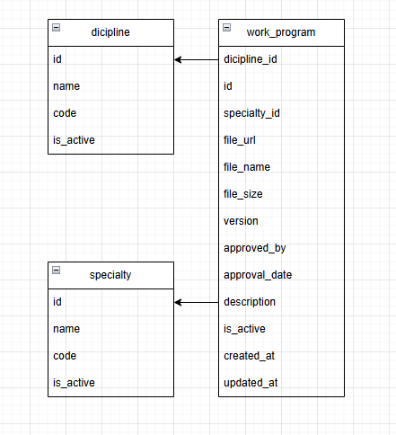

# S13 — Work Program Service (Сервис рабочих программ)

Сервис управляет рабочими программами дисциплин: хранит метаданные, путь к файлу, версию и год утверждения. Программа привязывается к дисциплине и может использоваться в нескольких специальностях. **Не хранит** сами дисциплины и специальности — они управляются Discipline Service и Specialty Service.

---

## Добавить рабочую программу

Информация, требуемая для создания рабочей программы:

| Параметр       | Пояснение                            | Обязательность | Тип     | Ограничение                               | Значение по умолчанию |
|----------------|--------------------------------------|----------------|---------|-------------------------------------------|-----------------------|
| title          | Название программы                   | Да             | string  | 1–255 символов                            | —                     |
| discipline_id  | ID дисциплины                        | Да             | integer | существующий id из Discipline Service     | —                     |
| version        | Версия программы                     | Да             | string  | 1–20 символов                             | —                     |
| approved_year  | Год утверждения                      | Да             | integer | ≥ 2000                                    | —                     |
| file_name      | Имя файла                            | Нет            | string  | до 255 символов                           | null                  |
| file_path      | Путь к файлу на сервере              | Нет            | string  | до 500 символов                           | null                  |
| description    | Описание программы                   | Нет            | string  | до 1000 символов                          | null                  |

**Уникальные комбинации параметров:**
- `(discipline_id, version, approved_year)` — у одной дисциплины не может быть двух программ с одинаковой версией в одном году утверждения.

Информация, возвращаемая при успешном создании:

| Параметр      | Тип               |
|---------------|-------------------|
| id            | integer           |
| title         | string            |
| discipline_id | integer           |
| version       | string            |
| approved_year | integer           |
| file_name     | string или null   |
| file_path     | string или null   |
| description   | string или null   |
| is_active     | boolean           |
| specialties   | list              |
| created_at    | string            |
| updated_at    | string            |

---

## Изменить рабочую программу по ID

Информация, требуемая для изменения (все поля необязательны):

| Параметр      | Пояснение               | Обязательность | Тип     | Ограничение                           |
|---------------|-------------------------|----------------|---------|---------------------------------------|
| title         | Новое название          | Нет            | string  | 1–255 символов                        |
| discipline_id | Новая дисциплина        | Нет            | integer | существующий id                       |
| version       | Новая версия            | Нет            | string  | 1–20 символов                         |
| approved_year | Новый год утверждения   | Нет            | integer | ≥ 2000                                |
| file_name     | Новое имя файла         | Нет            | string  | до 255 символов                       |
| file_path     | Новый путь к файлу      | Нет            | string  | до 500 символов                       |
| description   | Новое описание          | Нет            | string  | до 1000 символов                      |

Информация, возвращаемая при успешном изменении:

| Параметр      | Тип               |
|---------------|-------------------|
| id            | integer           |
| title         | string            |
| discipline_id | integer           |
| version       | string            |
| approved_year | integer           |
| file_name     | string или null   |
| file_path     | string или null   |
| description   | string или null   |
| is_active     | boolean           |
| specialties   | list              |
| created_at    | string            |
| updated_at    | string            |

---

## Удалить рабочую программу по ID

Вернёт `true`, если программа была деактивирована (`is_active = false`), иначе `false`. Физически запись из БД не удаляется.

---

## Получить рабочую программу по ID

| Параметр      | Пояснение                    | Тип               |
|---------------|------------------------------|-------------------|
| id            | Идентификатор                | integer           |
| title         | Название                     | string            |
| discipline_id | ID дисциплины                | integer           |
| version       | Версия                       | string            |
| approved_year | Год утверждения              | integer           |
| file_name     | Имя файла                    | string или null   |
| file_path     | Путь к файлу                 | string или null   |
| description   | Описание                     | string или null   |
| is_active     | Активна ли программа         | boolean           |
| specialties   | Список ID привязанных специальностей | list    |
| created_at    | Дата создания                | string |
| updated_at    | Дата последнего изменения    | string |

---

## Получить список рабочих программ по заданным параметрам

| Параметр      | Пояснение                        | Тип     |
|---------------|----------------------------------|---------|
| discipline_id | Фильтр по дисциплине             | integer |
| specialty_id  | Фильтр по специальности          | integer |
| approved_year | Фильтр по году утверждения       | integer |
| is_active     | Фильтр по активности             | boolean |
| search        | Поиск по названию                | string  |
| limit         | Количество записей (1–100)       | integer |
| offset        | Смещение (≥ 0)                   | integer |

Информация возвращается в виде списка рабочих программ, каждая содержит:

| Параметр      | Тип               |
|---------------|-------------------|
| id            | integer           |
| title         | string            |
| discipline_id | integer           |
| version       | string            |
| approved_year | integer           |
| file_name     | string или null   |
| is_active     | boolean           |
| created_at    | string |
| updated_at    | string |

---

## Привязать специальность к рабочей программе

| Параметр        | Пояснение          | Обязательность | Тип     | Ограничение                          |
|-----------------|--------------------|----------------|---------|--------------------------------------|
| work_program_id | ID рабочей программы | Да           | integer | существующий id                      |
| specialty_id    | ID специальности   | Да             | integer | существующий id из Specialty Service |

**Уникальные комбинации:** `(work_program_id, specialty_id)` — каждая пара уникальна.

Информация, возвращаемая при успешной привязке:

| Параметр        | Тип     |
|-----------------|---------|
| id              | integer |
| work_program_id | integer |
| specialty_id    | integer |

---

## Отвязать специальность от рабочей программы по ID записи

Вернёт `true`, если запись удалена, иначе `false`.

---

## Получить список специальностей рабочей программы по ID программы

| Параметр        | Пояснение              | Тип     |
|-----------------|------------------------|---------|
| work_program_id | ID рабочей программы   | integer |

Возвращается массив объектов:

| Параметр        | Тип     |
|-----------------|---------|
| id              | integer |
| work_program_id | integer |
| specialty_id    | integer |

---

## ER-диаграмма

